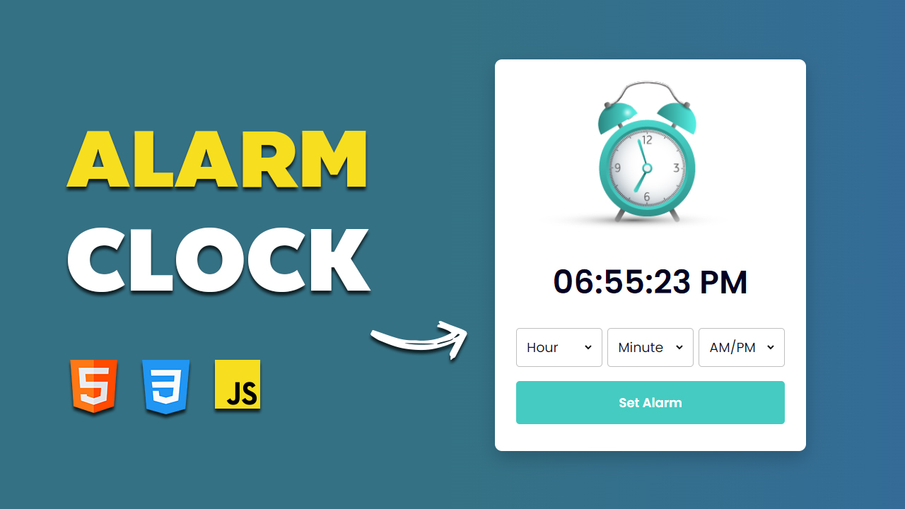

# Create a Functional Alarm Clock Using HTML, CSS & JavaScript
### Learn how to create a fully functional Alarm Clock app using just HTML, CSS, and JavaScript! ⏰ In this tutorial, we’ll guide you step-by-step to build an interactive and responsive alarm clock that works seamlessly across all devices. This project is perfect for beginners looking to practice their JavaScript skills and work with real-world functionality. 💻✨

## Watch the Full Tutorial on YouTube

